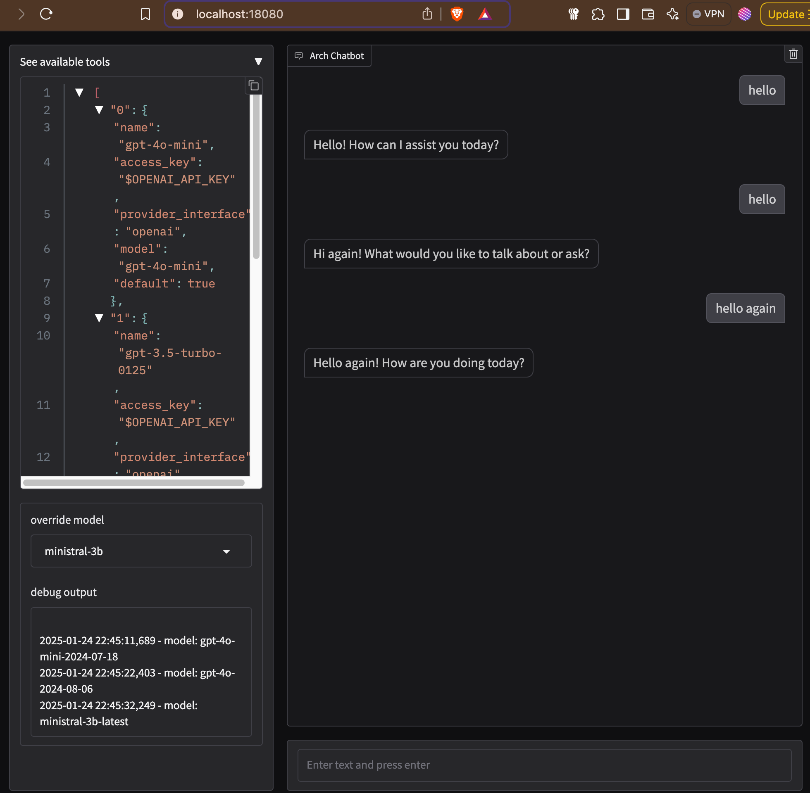
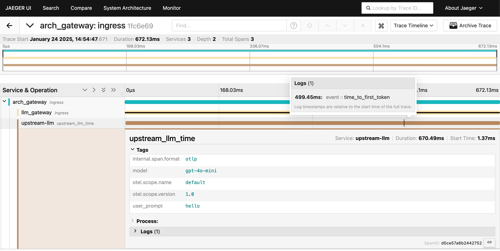

# LLM Routing
This demo shows how you can arch gateway to manage keys and route to appropriate LLM.

# Starting the demo
1. Please make sure the [pre-requisites](https://github.com/katanemo/arch/?tab=readme-ov-file#prerequisites) are installed correctly
1. Start Arch
   ```sh
   sh run_demo.sh
   ```
1. Navigate to http://localhost:18080/

Following screen shows an example of interaction with arch gateway showing dynamic routing. You can select between different LLMs using "override model" option in the chat UI.



You can also pass in a header to override model when sending prompt. Following example shows how you can use `x-arch-llm-provider-hint` header to override model selection,

```bash

$ curl --header 'Content-Type: application/json' \
  --header 'x-arch-llm-provider-hint: ministral-3b' \
  --data '{"messages": [{"role": "user","content": "hello"}]}' \
  http://localhost:12000/v1/chat/completions 2> /dev/null | jq .
{
  "id": "xxx",
  "object": "chat.completion",
  "created": 1737760394,
  "model": "ministral-3b-latest",
  "choices": [
    {
      "index": 0,
      "message": {
        "role": "assistant",
        "tool_calls": null,
        "content": "Hello! How can I assist you today? Let's chat about anything you'd like. 😊"
      },
      "finish_reason": "stop"
    }
  ],
  "usage": {
    "prompt_tokens": 4,
    "total_tokens": 25,
    "completion_tokens": 21
  }
}

```

# Observability
Arch gateway publishes stats endpoint at http://localhost:19901/stats. In this demo we are using prometheus to pull stats from arch and we are using grafana to visualize the stats in dashboard. To see grafana dashboard follow instructions below,

1. Navigate to http://localhost:3000/ to open grafana UI (use admin/grafana as credentials)
1. From grafana left nav click on dashboards and select "Intelligent Gateway Overview" to view arch gateway stats
1. For tracing you can head over to http://localhost:16686/ to view recent traces.

Following is a screenshot of tracing UI showing call received by arch gateway and making upstream call to LLM,


