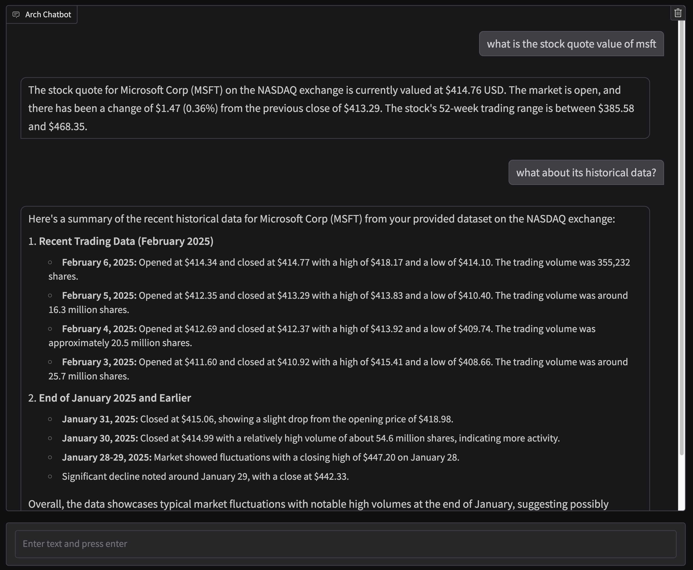

This demo shows how you can use a publicly hosted rest api that is protected by an access key.

Before you start the demo make sure you set `OPENAI_API_KEY` and `TWELVEDATA_API_KEY`.

To get `TWELVEDATA_API_KEY` please head over to https://twelvedata.com/.

Following screenshot shows interaction with stock quote demo,

