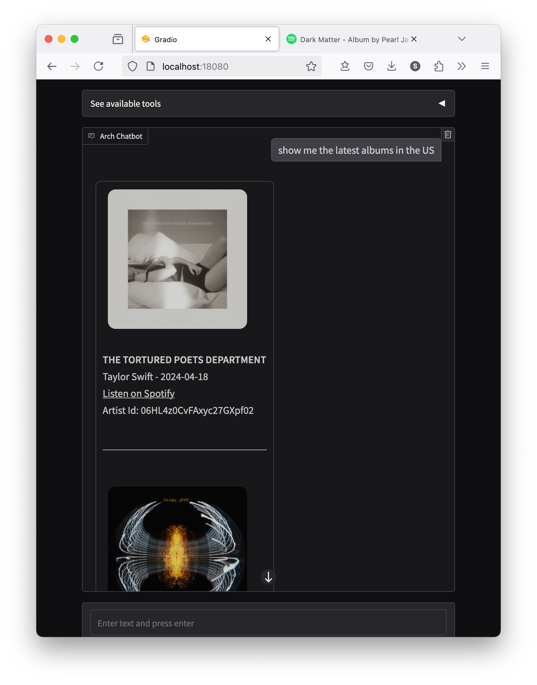

# Use Case Demo: Bearer Authorization with Spotify APIs

In this demo, we show how you can use Arch's bearer authorization capability to connect your agentic apps to third-party APIs.
More specifically, we demonstrate how you can connect to two Spotify APIs:

- [`/v1/browse/new-releases`](https://developer.spotify.com/documentation/web-api/reference/get-new-releases)
- [`/v1/artists/{artist_id}/top-tracks`](https://developer.spotify.com/documentation/web-api/reference/get-an-artists-top-tracks)

Where users can engage by asking questions like _"Show me the latest releases in the US"_, followed by queries like _"Show me top tracks from Taylor Swift"_.



## Starting the demo

1. Ensure the [prerequisites](https://github.com/katanemo/arch/?tab=readme-ov-file#prerequisites) are installed correctly.
2. Create an `.env` file with API keys for OpenAI and Spotify.
   - Sign up for an OpenAI API key at [https://platform.openai.com/signup/](https://platform.openai.com/signup/)
   - Sign up for a Spotify Client Key/Secret by following instructions at [https://developer.spotify.com/dashboard/](https://developer.spotify.com/dashboard/)
   - Generate a Spotify token using the [https://accounts.spotify.com/api/token API](https://accounts.spotify.com/api/token), using ```curl``` or similar commands.
   - Create a .env file with the following keys:
   ```
   OPENAI_API_KEY=your_openai_api_key
   SPOTIFY_CLIENT_KEY=your_spotify_api_token
   ```

3. Start Arch
   ```sh
   sh run_demo.sh
   ```
4. Navigate to http://localhost:18080
5. Ask "show me new album releases in the US"
